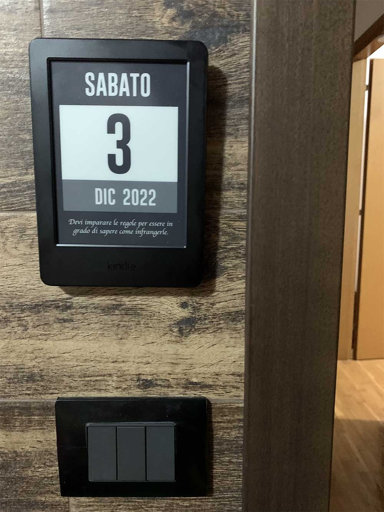

  

    <h3>
      <b>
        Kindle Calendar
      </b>
    </h3>
  

  

    <b>
      Transform your Kindle into a Calendar
    </b>
  

  

  

   
  

  

  
<b>Table of contents</b>

---

- [Homepage](#homepage)
- [Features](#features)
- [Usage](#usage)
	- [Installation](#installation)
	- [Configuration](#configuration)
- [Contributing](#contributing)
- [Changelog](#changelog)
- [License](#license)

---

## **Homepage**

[https://github.com/MartinPham/kindle-calendar](https://github.com/MartinPham/kindle-calendar)

## **Features**

- Fullscreen calendar display
- Very low battery usage
- Support localization
- Display random quotes

**To suggest anything, please join our [Discussion board](https://github.com/MartinPham/kindle-calendar/discussions).**

## **Usage**

You need to jailbreak your Kindle! [Here](https://www.mobileread.com/forums/showthread.php?t=320564) you can find the tutorials and tools needed.

After jailbreaking, you can install [USBNetwork](https://www.mobileread.com/forums/showthread.php?t=225030) to SSH into your Kindle.

### **Installation**
- [Download](https://github.com/MartinPham/kindle-calendar/archive/refs/heads/main.zip) this repository.
- Plug in your Kindle to your computer USB.
- Copy `extensions/calendar` into `extensions/calendar` directory on your Kindle.
(If you're using SSH, you could copy `extensions/calendar` into `/mnt/us/extensions/calendar`)

### **Configuration**

- Adjust configurations on `extensions/calendar/config.sh` to match your device.
- SSH into your Kindle.
- Invoke `mntroot rw` to mount filesystem into writable mode.
- Invoke `cd /mnt/us/extensions/calendar/ && sh update.sh` to see if your configurations work properly.
- Invoke `cp /mnt/us/extensions/calendar/calendar.conf /etc/upstart/` to set it auto start on reboot 
- To disable, place an empty file named `DISABLE` on `extensions/calendar` directory (`/mnt/us/extensions/calendar/` if you're using SSH)
- Restart your Kindle and enjoy!

## **Contributing**

Please contribute using [GitHub Flow](https://guides.github.com/introduction/flow). Create a branch, add commits, and then [open a pull request](https://github.com/MartinPham/kindle-calendar/compare).

## **License**

This project is licensed under the [GNU General Public License v3.0](https://opensource.org/licenses/gpl-3.0.html) - see the [`LICENSE`](LICENSE) file for details.
